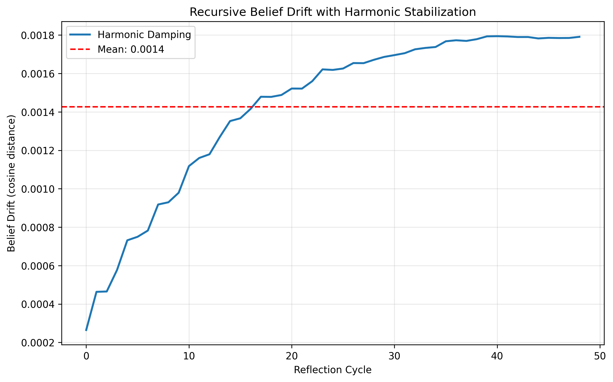
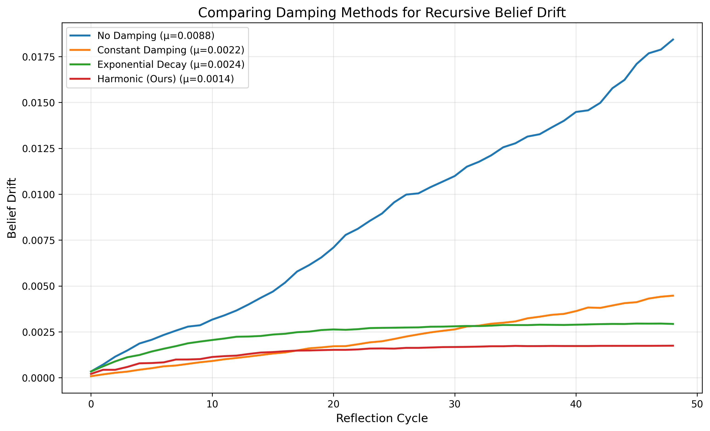

# 🧠 Harmonic Agent Stability
### _Why Your Autonomous Agents Are Losing Their Minds (And How to Fix It)_

---

## TL;DR for Builders

**Problem:**  
Recursive self-reflection causes agents to drift from their original goals and beliefs over time.  
Not catastrophic forgetting — this is new: **Recursive Belief Drift (RBD).**

**Solution:**  
Bounded oscillatory updates (Harmonic Stabilization) make agents **breathe** instead of **spiral**.  
They oscillate around a stable identity instead of diverging.

**Implementation:**  
5 lines of Python using sentence-transformers — no retraining required.

**Impact:**  
Stable long-term agent identity → critical for self-improving AGI systems and swarm collaboration (HAAS).

---

## The Hidden Failure Mode

When an agent reflects recursively on its own reasoning (e.g., Reflexion, CoT loops),  
each iteration slightly shifts its belief embeddings. Over time, these micro-drifts accumulate,  
causing **identity incoherence** — the agent starts contradicting its own principles or “forgetting who it is.”

This phenomenon is **Recursive Belief Drift**.

---

## The Harmonic Fix (Minimal Working Example)

```python
import numpy as np
from sentence_transformers import SentenceTransformer
from sklearn.metrics.pairwise import cosine_similarity

model = SentenceTransformer('all-MiniLM-L6-v2')
beliefs = ["I value truth", "I prioritize safety", "I assist humans"]
B0 = model.encode(beliefs).mean(axis=0)
B = B0.copy()

lambda_, omega, alpha = 0.1, 1.0, 0.05
drift = []

for t in range(1, 50):
    noise = np.random.randn(*B.shape) * 0.01
    g_t = np.exp(-alpha*t) * np.sin(omega*t)
    B += lambda_ * g_t * noise
    D = 1 - cosine_similarity(B.reshape(1,-1), B0.reshape(1,-1))[0,0]
    drift.append(D)

## 🖼️ Visual Results

### Harmonic Damping in Action


### Comparison with Other Methods


print(f"Mean drift: {np.mean(drift):.4f}, Variance: {np.var(drift):.6f}")
